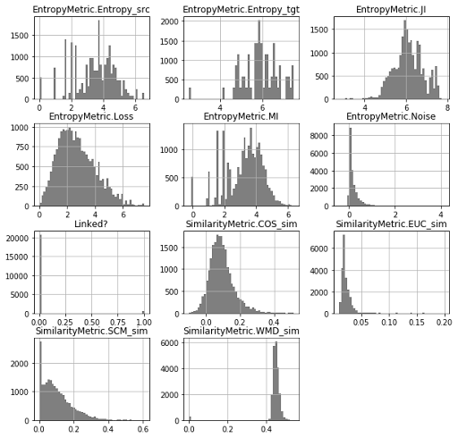
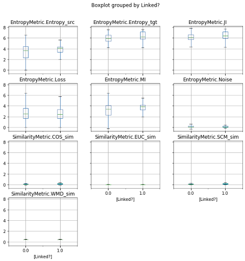
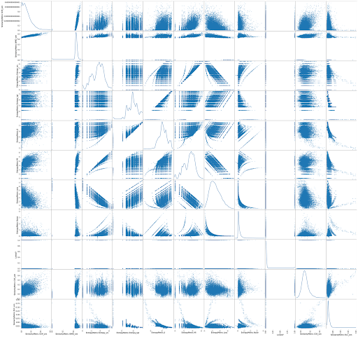
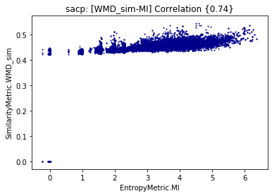
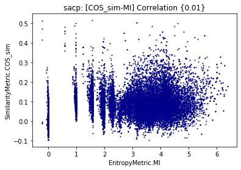
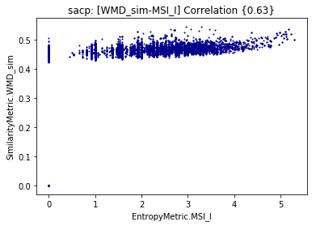
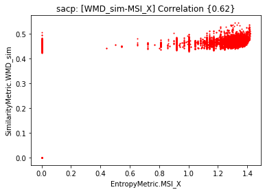
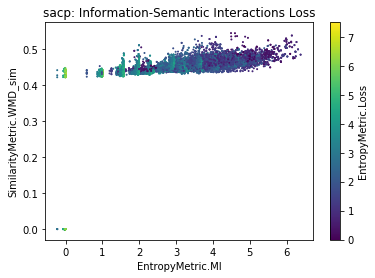
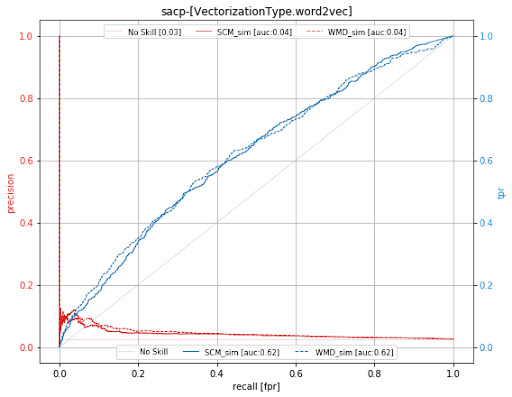
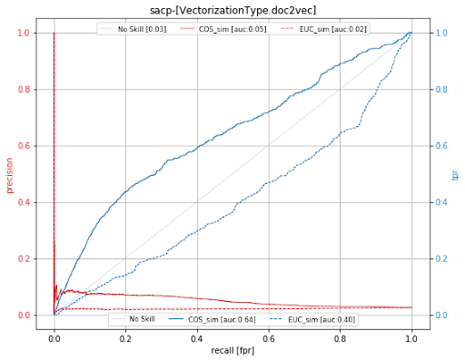

# On Interpreting the Effectiveness of UnsupervisedSoftware Traceability with Information Theory
>
> By Daniel and @danaderp | Updated: 20.12.2024
>

Traceability is a cornerstone of modern software development, ensuring system reliability and facilitating software maintenance. While unsupervised techniques leveraging Information Retrieval (IR) and Machine Learning (ML) methods have been widely used for predicting trace links, their effectiveness remains underexplored. In particular, these techniques often assume traceability patterns are present within textual data - a premise that may not hold universally. Moreover, standard evaluation metrics such as precision, recall, accuracy, or F1 measure can misrepresent the model performance when underlying data distributions are not properly analyzed. Given that automated traceability techniques struggle to establish links – even for well-studied datasets properly – we need further insight into the information limits related to traceability artifacts. 
In this paper, we propose an approach called _TraceXplainer_for using information theory metrics to evaluate and better understand unsupervised traceability techniques' performance (limits). Specifically, we introduce self-information, cross-entropy, and mutual information (MI) as metrics to measure the informativeness and reliability of traceability links. Through a comprehensive replication and analysis of well-studied datasets and techniques, we investigate the effectiveness of unsupervised techniques that predict traceability links using IR/ML. This application of _TraceXplainer_ illustrates an imbalance in typical traceability datasets where the source code has on average 1.48 more information bits (i.e., entropy) than the linked documentation. Additionally, we demonstrate that an average MI of 4.81 bits, loss of 1.75, and noise of 0.28 bits signify that there are information-theoretic limits on the effectiveness of unsupervised traceability techniques. We hope that these findings spur additional research on understanding the limits and progress of traceability research.

## Introduction
This research investigates the challenges of information transmission in software traceability, focusing on semantic relationships among software artifacts such as code, requirements, and test cases. Unsupervised information retrieval techniques like TF-IDF, LSA, or LDA are commonly used to represent these artifacts as vectors in a derived space, enabling the calculation of semantic closeness through distance metrics. However, the effectiveness of these techniques is limited by issues such as data imbalance, bias, and poor-quality artifacts. For example, poorly written requirements or undocumented code hinder the traceability process, making it inefficient for tasks like impact analysis. This research emphasizes the need for rigorous statistical approaches and information-theoretic measures to assess and improve the reliability of predicted trace links.

Theoretically, software requirements should be amenable to being translated into multiple forms of information such as source code, test cases, or design artifacts. Thus, we refer to these requirements or any initial/raw form of information as the *source artifacts*. Conversely, the information that is a product of a transformation or alteration is considered a *target artifact*. In the software engineering context, a transformation could be any action that a software engineer applies from those requirements. For instance, implementing a requirement can be seen as a way of translating information from the requirements to the source code.

The approach we have used in this study aims to calculate a set of information measures to complement and explain the limitations of semantic traceability techniques. Understanding such limitations (or bounds) will allow us to assess how well traceability algorithms work for a given software project. Numerous experiments have established that studying the manifold of information measures might help us to detect critical points in the artifacts. These critical points are potentially missed documentation or repetitive tokens that need to be refactored to enhance the effectiveness of traceability algorithms. 

This research introduces _TraceXplainer_, an interpretability framework leveraging information-theoretic metrics such as mutual information and entropy to diagnose the shortcomings of unsupervised models in traceability. Through empirical analysis, the authors reveal that textual artifacts often lack sufficient information for effective trace link prediction, as seen in the examination of the CSC system, where pull request comments and code exhibit significant information imbalance. Findings highlight that low mutual information between artifacts indicates potential information loss, undermining traceability. The research calls for data-centric evaluations to identify and address the limitations of testbeds and traceability techniques, ultimately proposing strategies to enhance information quality and model robustness.


---------

## 1. TraceXplainer Code Artifacts
**TraceXplainer** comprises a set of steps for training and evaluating machine learning models for traceability link recovery. On this evaluation and training, the set of datasets and  Python notebooks are listed as follows:

| **Artifact**           | **Repository Folder**     | **Description**                                                                                                 |
|------------------------|---------------------------|-----------------------------------------------------------------------------------------------------------------|
| _Documented Notebooks_ | [Python Notebooks](https://github.com/WM-SEMERU/traceXplainer/tree/master/notebooks) | Notebooks data collection, model training and statistical analysis |
| _Source Code_          | [main/ds4se](https://github.com/WM-SEMERU/traceXplainer/tree/master/main/ds4se)      | Python project code with the implementation for mining CSC datasets, model training, metrics, clusterization process  and experiment configuration                    |
| _Source Code_          | [main/t-miner](https://github.com/WM-SEMERU/traceXplainer/tree/master/main/t-miner)  | Exploratory tool for traceability visualization       |
| _Datasets_          | [dvc-data/systems](https://github.com/WM-SEMERU/traceXplainer/tree/master/dvc-data/systems) |  System datasets used for _TraceXplainer_ experiments, each system includes the corpus and vectorization for doc2vect and word2vec models |


### Documented Notebooks
The folder `notebooks` contains several books for _TraceXplainer_ analysis.

1. [Data and model exploratory analysis](https://github.com/WM-SEMERU/traceXplainer/blob/master/notebooks/0.1_mgmnt.prep.ipynb)
2. [Word2Vec training](https://github.com/WM-SEMERU/traceXplainer/blob/master/notebooks/2.3_repr.word2vec.train.ipynb)
3. [Word2Vec evaluation](https://github.com/WM-SEMERU/traceXplainer/blob/master/notebooks/2.6_repr.word2vec.eval.ipynb)
4. [Unsupervised traceability eda](https://github.com/WM-SEMERU/traceXplainer/blob/master/notebooks/3.1_traceability.unsupervised.eda.ipynb)
5. [Unsupervised traceability Doc2Vec](https://github.com/WM-SEMERU/traceXplainer/blob/master/notebooks/3.2_traceability.unsupervised.approach.d2v.ipynb)
6. [Unsupervised traceability Word2Vec](https://github.com/WM-SEMERU/traceXplainer/blob/master/notebooks/3.2_traceability.unsupervised.approach.w2v.ipynb)
7. [Exploratory Analysis - Information retreival](https://github.com/WM-SEMERU/traceXplainer/blob/master/notebooks/4.0_infoxplainer.ir.ipynb)
8. [Descriptive Analysis](https://github.com/WM-SEMERU/traceXplainer/blob/master/notebooks/4.5_infoxplainer.description.eval.traceability.ipynb)
9. [Traceability Effectiveness Evaluation](https://github.com/WM-SEMERU/traceXplainer/blob/master/notebooks/4.6_infoxplainer.prediction.eval.traceability.ipynb)


---------

## 2. Empirical Evaluation Setup

The results presented in this section are a product of the optimal configuration of IR techniques for software traceability reached with baseline datasets (LibEst, iTrust, eTour, EBT, and SMOS). This configuration is defined as follows: conventional preprocessing, which includes stemming, camel case splitting, and stop word removal. The traceability arrow is from “issues'' to “source code” (issue2src). The vectorization technique employed is skip-gram (word2vec) and paragraph vector bag of words (pv-bow) (doc2vec). The pretraining was performed with the Java and Python code search net dataset. The embedding size was 500 and the number of epochs was 20 for each model.

The data science information pipeline is composed of 2 analyses and 1 chapter for case studies. The 2 analyses are:

- _Exploratory Data Analysis for Interpreting Traceability_. The goal of this section is to measure the set of information measures and summarize the results in probability distributions. The data is also analyzed according to the ground truth and variable correlations. This exploration allows us to interpret how well an unsupervised technique for traceability will perform.  
- _Supervised Evaluation_. The goal of this section is to show the effectiveness of the unsupervised techniques and their limitations due to information measures.  

## 3. Exploratory Data Analysis for Interpreting Traceability

Exploratory Data Analysis is an exhaustive search of patterns in data with a specific goal in mind. For this report, our goal is to use information measures to describe and interpret  the effectiveness of unsupervised traceability techniques. This section introduces 3 explorations:
1. __Manifold of Information Measures__. The purpose of this exploration is to determine the probability distribution of each entropy and similarity metric. We have some assumptions about how we expect these distributions to be. For instance, similarity distributions should be bimodal since we want to observe a link and a non-link. If our assumptions do not match the expected distribution, then we can assess the quality of the technique. 
2. __Manifold of Information Measures by Ground truth__. The purpose of this exploration is to group each entropy and similarity metric by a given ground truth. The division of data by the ground truth allows us to determine the quality of the prediction for similarity metrics. Additionally, it also allows us to describe how good the ground truth is since we are measuring the information transmission between source and target artifacts. 
3. __Scatter Matrix for Information Measures__. The purpose of this exploration is to find correlations between information theory metrics and unsupervised similarities. These correlations help us to explain the traceability behavior from information transmission for a given dataset. 

<div align="center"></div>
<div align="center"></div>
<div class="caption">
    Figure 1 & 2. Probability distributions of Similarities and Information Measures (and grouped by Ground Truth)
</div>

### 3.1 EDA1: Manifold of Information Measures
The following manifold depicts the distribution of each information variable. We can observe that the self-information of the source artifacts (or issues) is on average [3.42 ± 1.31] B (or bits), while the self-information of the target artifacts (or source code) is on average [5.91 ± 0.86] B. This means that the amount of information in the source code is 1.72 bits larger than the amount of information in the set of issues. Now, the mutual information is on average [3.21 ± 1.19] B, the minimum shared entropy is [1.45 ± 1.14] B, and the minimum shared extropy is [0.87 ± 0.54] B. 

The loss and noise are both gaussian distributions with a median of 2.53B and 0.11B respectively. The loss is larger than the noise by a range of 2.42B. If we consider that the median of the minimum shared entropy is 1.50B, then the amount of lost information is high. This might indicate that the source code is poorly commented. Furthermore, the noise is barely a bit unit, which indicates that the code is not influenced by an external source of information. 

The similarity metrics have a non-standard behavior. For instance, let’s compare the cosine similarity (for doc2vec) and the WMD_sim (for word2vec). The average value of the cosine is [0.09 ± 0.07], while the value for the WMD_sim is [0.45 ±0.90]. Both similarity distributions are unimodal, which indicates that the binary classification does not exist and both similarities are not overlapping. 

> __Summary__: the maximum transmission of information was around 4.4 bits from issues to source code. If we observe the link {PR-294 ➝ psb_mapping.py}, which corresponds to the minimum MI of 5.5 B in the 99% quantile,  then we infer that the 4.4 B of maximum transmission can be improved until reaching an average value of 5.5B. We recommend that software developers implement inspection procedures to refactor documentation in both requirements and source code to enhance mutual information (and MSI).

### 3.2 EDA2: Manifold of Information Measures by Ground Truth 
Unfortunately, information measures are not being affected by the nature of the traceability. That is, information is independent of whether a link between two artifacts exists or not. Nonetheless, all sequence-based artifacts are related somehow (or share some amount of information), this “independent” behavior is not expected in similarity metrics such as softcosine, euclidean, or word mover’s distance. Neural unsupervised techniques based on skip-gram models are unable to binary classify a link. In other words, data do not have encoded the necessary patterns to determine the classification. We need to employ probabilistic models to intervene in the expectation value of a link (see COMET approach) or systematic refactorings on the artifacts.

- Self-Information of source artifacts _I(X)_. 
    - Linked [3.80 ± 1.16] B | Median: 4.12 B
    - Non-Linked [3.41 ± 1.31] B | Median: 3.64 B
    - _Interpretation_: Confirmed links and non links intervals are overlapping in a large entropy range for the source set. The distance between the medians is around 0.48B. We cannot see any entropy difference between linked and non-linked source artifacts. 
- Self-Information of target artifacts _I(Y)_. 
    - Linked [6.23 ± 0.89] B | Median: 6.21 B
    - Non-Linked [5.90 ± 0.86] B | Median: 5.90 B
    - _Interpretation_: Confirmed links and non links intervals are overlapping in a large entropy range for the target set. The distance between the medians is around 0.31B. We cannot see any entropy difference between linked and non-linked source artifacts.
- Mutual Information _I(X:Y)_.  
    - Linked [3.60 ± 1.06] B | Median: 3.85 B
    - Non-Linked [3.20 ± 1.19] B | Median: 3.39 B
    - _Interpretation_: Confirmed links and non links intervals are overlapping in a large mutual information range for both sets. The distance between the medians is around 0.46B. Mutual information does not work as a predictor of links with the given ground truth. We expect high mutual information in confirmed links and low mutual information in non-links. 
- Information Loss _I(X\|Y)_. 
    - Linked [2.63 ± 1.33] B | Median: 2.46 B
    - Non-Linked [2.71 ± 1.35] B | Median: 2.53 B
    - _Interpretation_: Confirmed links and non links intervals are overlapping in a large entropy loss range for both sets. The distance between the medians is around 0.07B. The loss is basically the same for links and non links. We expect high loss in non-links. 
- Information Noise I(Y\|X). 
    - Linked [0.20 ± 0.31] B | Median: 0.09 B
    - Non-Linked [0.21 ± 0.30] B | Median: 0.11 B
    - _Interpretation_: Confirmed links and non links intervals are overlapping in a large entropy noise range for both sets. The distance between the medians is around 0.02B. The noise is basically the same for links and non links. We expect high noise in non-links.  
- Minimum Shared of Information for Entropy.
    - Linked [1.98 ± 1.11] B | Median: 2.00 B
    - Non-Linked [1.44 ± 1.14] B | Median: 1.50 B
    - _Interpretation_: The distance between the medians is around 0.5B. We expect high shared information in confirmed links and low shared information in non-links for the entropy.
- Minimum Shared of Information for Extropy.
    - Linked [1.07 ± 0.43] B | Median: 1.25 B
    - Non-Linked [0.86 ± 0.54] B | Median: 1.12 B
    - _Interpretation_: The distance between the medians is around 0.13B. We expect low shared information in confirmed links and high shared information in non-links for the extropy.

> __Summary__: Even though the amount of information in the source code is larger than the amount of information in the set of issues; the MI, loss, and noise are indistinguishable from confirmed links to non-links. We expect low amounts of mutual information and high amounts of loss and noise for non-related artifacts. 

### 3.3 ED3: Scatter Matrix for Information Measures
Correlations are helpful to explain variables that we are not easily able to describe just by observing their values. Correlations are useful to interpret the causes or detect similar patterns for a given metric. In this case, we want to study similarity variables by correlating them with other similarity variables and information measures (e.g., MI, Loss, Noise, Entropy, etc). The following manifold in Figure 3 depicts all the correlations and distribution of each information variable. We want to highlight that the WMD similarity is mostly positively correlated (~0.74) with other information metrics, while COS similarity has the opposite effect. 
<div align="center"></div>
<div class="caption">
    Figure 3. Correlation Analysis of Similarity and Information Measures.
</div>

### 3.4 Mutual Information & Shared Information Entropy and Extropy
This analysis consists of computing a correlation between the distance and entropy. Mutual information is positively correlated with WMD similarity as observed in Figure4. This implies that the larger the amount of shared information, the more similar the artifacts. The previous statement makes sense until we observe that MI is not correlated with the cosine similarity. Is the word vector capturing better semantic relationships than paragraph vectors? Both approaches are not performing well according to the supervised evaluation. 
<div align="center"></div>
<div align="center"></div>
<div class="caption">
    Figure 4. Similarity and Mutual Information
</div>

On the other hand, the MSI for entropy is also positively correlated with the WMD as depicted in Figure 5. The trend is expected after observing the correlation with the mutual information. However, the extropy is also positively correlated. We are showing more evidence that WMD similarity is capturing better semantic relationships among the artifacts. 
<div align="center"></div>
<div align="center"></div>

<div class="caption">
    Figure 5. Similarity and Shared Information
</div>

### 3.5 Composable Manifolds 
The composable manifolds are useful for inspecting a third information variable. In this case, we focused on the loss and noise (see Figure 6). We can observe that the loss is larger when the mutual information and similarity are lower. However, the noise is more dispersed across the mutual information and similarity. We find different clusters of noise in low and larger ranges of MI. These trends indicate that there is some amount of information that was injected in the source code but it is independent of the conceptual similarity of two artifacts.    

<div align="center"></div>
<div align="center"></div>

<div class="caption">
    Figure 6. Loss & Noise with Similarity and Mutual Information
</div>


> __Summary__: Loss entropy is related to low levels of similarity and mutual information. We need to intervene in the datasets to help classify the links by reducing the loss. Such interventions (or refactorings) can occur because developers or stakeholders complete or document artifacts during the software lifecycle.  

## Supervised Evaluation 

The supervised evaluation consists of measurements of the accuracy of the link recovery. The link recovery is computed in terms of precision, recall, and AUC. Nevertheless, both techniques do not capture semantic similarity efficiently, the skip-gram model has a better efficiency than the paragraph-distributed model for the _CSC_ dataset. This is not a problem of the unsupervised learning approach but a limitation of the data. The data are insufficient to capture patterns that contribute to the binary classification or traceability generation. If we observe Figure 2, we can explain this behavior by stating that both WMD_similarity and COS_sim are not different when grouped by ground truth. What is more, the median information in source artifacts is 1.12B, while the median in target artifacts is 3.65. Such a situation created an imbalance of information not allowing unsupervised techniques to capture features from source artifacts. In fact, the median MSI for confirmed links is 2.0, which is quite low considering that the MSI max value is 5.23.  

<div align="center"></div>
<div align="center"></div>

<div class="caption">
    Figure 7. Precision-Recall & AUC Performance
</div>

> __Summary__: The set of confirmed links and non-links are extremely imbalanced. Cosine and Soft-Cosine similarities behave better under AUC analysis, which means they identify non-links with a minimum effectiveness of 0.62. However, neural unsupervised techniques failed at identifying actual links since the data is not “naturally” partitioned or grouped (see EDA grouped by ground truth). 


## Some Use Cases
This section shows four information science cases from processing the _CSC_ system. The whole set of experiments and samples can be found in this link. 
- __Case 0: Self-Information__. This study highlights the imbalance of information between the source and target artifacts.
- __Case 1: Minimum and maximum loss__. This study presents edge cases for entropy loss. This is useful for detecting poorly documented target artifacts.  
- __Case 2: Minimum and maximum noise__. This study presents edge cases for the entropy noise. This is useful for detecting poorly documented source artifacts.
- __Case 3: Orphan informative links__. This study points out a set of informative links that are not found in the ground truth. 

Consider the following notation for this section. The down arrows 🠗 represent the minimum entropy value observed. Up arrows 🠕 depict the maximum entropy value observed. Entropy values are given in bit unit (B). Links with a value 1.0 are _confirmed-links_, whereas links with value 0.0 are _non-links_. 

## Case Study 0: Self-Information
- Case Study 0.1: Low Entropy Artifacts 
In some cases, low amounts of information in source artifacts might indicate that pull requests (or requirements) are undocumented. For example, PR with the following IDs has a zero (or minimum) entropy value: PR-241, PR-168, PR-144, PR-128, PR-113, PR-101, and PR-41. Low amounts of information in target artifacts might suggest that the source code is repetitive, undocumented, or empty. For example, these files (<=0.05 quantile) have an entropy less than <= 4.74 B: webex_send_func.py, ipcReport.py, fireException.py, and (of course) \__init__.py. 
- Case Study 0.2: High Entropy Artifacts 
In some cases, high amounts of information in source (and target) artifacts might indicate that the inspected pull request (or source file) has a diverse set of tokens that describe or determine the content of the artifact. In other words, high entropy may indicate the relevance of the artifact. For instance, PR with the following IDs has a max entropy of 6.56: PR-256 and PR-56. While these files (>=0.97 quantile) have an entropy greater than 7.45 B: security_results_push_func.py, binary_scan_func.py, and run_ipcentral_automation.py
- _Discussion_. Artifacts with low levels of entropy struggle to generate traceability links in view of the fact that unsupervised techniques rely on concise descriptions in natural language. By contrast, high levels of entropy struggle with other conditions like loss or noise. Refactoring operations need to be applied to source and target artifacts to combat the imbalance of information. At least, a semantic idea expressed as a clause is required in both artifacts to guarantee a link. When we preprocess the source code, we transform the code structure into a sequence structure to extract those clauses. In other words, source code is not treated as a structured language but as a regular text file. The amount of information lost by preprocessing source code as text has not been yet computed.    

## Case Study 1: MaxMin Loss
- Case Study 1.1: Max Case
    - Pull Request ID (self-entropy 0.0🠗 B): 241 
    - PR Content: “Reportbugs”
    - Source Code ID (self-entropy 7.50🠕 B): “sacp-python-common/sacp_python_common/security_results_push/security_results_push_func.py”
    - Loss: 7.5 B
    - Trace Link: non-link

- Case Study 1.2: Min Case
    - Pull Request ID (self-entropy 6.56🠕 B): 256 
    - PR Content: “'Parameterize corona hostname This is intended to be a backward-compatible addition of the ability to set the Corona hostname using a new `--corona-hostname` flag that is not required and defaults to corona.cisco.com.  The underlying Corona, Bom, Cve, and Triage classes are also updated in a backward-compatible way to add the ability to set the `corona_hostname` init parameter, also with a default value.  I tried to follow the pattern I saw in use for the `job_name` and `build_tag` parameters, assuming that this snippet is what will automagically set the `self.corona_hostname` attribute: ```     def create_argument_parser(self, **kwargs):         ...         parser.add_argument(             "--corona-hostname", type=str, help="Corona hostname", default="corona.cisco.com"         )         ...      def run(self):         # parse the command line arguments         arguments = self.create_argument_parser(description=__doc__).parse_args()         # populate the argument values into self         for arg in vars(arguments):             setattr(self, arg, vars(arguments)[arg])         ... ```  I think I got everything that needs to change, but this is my first work with the module so I\'d be happy to step through things on a WebEx with someone if you\'d like.  I\'m not going to document this feature as I don\'t want to give too many teams the idea to start pipelining builds to Corona staging, but as I\'ve mentioned we need this so we can integrate the `binaryScan` step into our staging sanity test stage so we can catch any API drift before it hits production.  Next steps will be to update the container\'s [entrypoint](https://wwwin-github.cisco.com/SACP/CSB-CICD-Containers/blob/master/entrypoints/run_3rd_party.sh#L6) so it knows how to call the binaryScan module with the new flag if it\'s provided, then to update the binaryScan Groovy to look for this parameter in the config map and pass to the [docker_run and venv_run closures](https://wwwin-github.cisco.com/SACP/sectools-jenkins-lib/blob/master/vars/binaryScan.groovy#L109-L207”
    - Source Code ID (self-entropy 4.82 B): “sacp-python-common/sacp_python_common/third_party/cve.py”
    - Loss: -0.01036
    - Trace Link: confirmed-link

- Case Study 1.3: Quantile Loss (>=0.99) for Positive Links
In this study, we are just observing the loss of 99% quantile for positive links. 
    - Pull Request ID (self-entropy 5.09 B): 193
    - PR-Content: “CIC-698: Git pre-commit hook for linting This PR adds pre-commit hooks for python file linting. It accomplishes this by using black, flake8, and isort.  Also added in this commit is Pipenv for dependency tracking and virtual environment for development.  The changes were ran through the HelloWorld demo build we have, linked [here](https://engci-jenkins-rtp.cisco.com/jenkins/job/team_SACP/job/DemoBuilds/job/Python3.7/).”
    - Source Code ID (self-entropy 2.52🠗 B): sacp-python-common/sacp_python_common/template/\__init__.py
    - Source Code Content: “import os\r\n\r\nTEMPLATE = os.path.dirname(os.path.realpath(\__file__))\r\n”
    - Loss: 2.76🠕 B

_Discussion_. Edge cases of loss are useful to detect starting points for general refactoring in the target documentation. The max case shows us the pull request content is composed of just one word. The tokens that represent this word were not found in the target security_results_push_func.py, which is one of the highest entropy files. Whereas, the min case shows us the pull request has a complete description that was not found in the target.  Now, let’s pay attention to the 99% quartile for positive links. The PR-Content cannot be easily found in the source code with low entropy. Even if a software engineer tries to do a manual extraction of links. The relationship is not evident. 


## Case Study 2: MaxMin Noise
- Case Study 2.1: Max Case
    - Pull Request ID (self-entropy 6.56🠕): 256
    - PR Content: see above
    - Source Code ID (self-entropy 2.52🠗): “csc-python-common/csc_python_common/template/\__init__.py”
    - Noise: 4.12 B
    - Trace Link: non-link


- Case Study 2.2: Min Case
    - Pull Request ID (self-entropy 3.38): 213
    - PR Content: “'Third Party refactor (#211) * folder  * first stage changes  * first stage changes  * first stage changes  * unittest  * unittest  * unittest  * unittest  * unittest  * unittest  * unittest  * unittest  * stage two changes  * stage two changes  * stage two changes  * stage two changes  * stage two changes  * stage two changes  * stage two changes  * stage two changes  * stage two changes  * stage two changes  * stage two changes  * stage two changes  * stage two changes  * stage two changes  * unittest  * unittest  * unittest  * unittest  * unittest  * unittest  * unittest  * unittest  * unittest  * unittest  * bd fix + unittest  * unittest  * unittest  * unittest  * unittest  * unittest  * unittest  * unittest  * unittest  * unittest  * unittest  * unittest  * unittest  * unittest  * unittest  * unittest  * unittest  * unittest  * unittest  * unittest  * unittest  * unittest  * unittest  * unittest  * unittest  * unittest  * unittest  * unittest  * unittest  * unittest  * unused function  * unittest  * unittest  * unittest  * unittest  * unittest  * unittest  * unittest  * unittest  * unittest  * 3rd party refactor  * bugfix  * bugfix  * bugfix  * bugfix  * bugfix  * bugfix  * bugfix  * bugfix  * bugfix  * bugfix  * bugfix  * bdfix  * bdfix  * bdfix  * conflict  * BD fusion  * bd fusion  * bd fusion  * bd fusion  * bd fusion  * Corona class  * Corona class  * Corona class  * Corona class  * Corona class  * Corona class  * Corona class  * byos tests  * byos tests  * byos tests  * byos tests  * byos tests  * byos tests  * byos tests  * byos tests  * byos tests  * byos tests  * byos tests  * bugfix  * bugfix  * bugfix  * bugfix”
    - Source Code ID (self-entropy 5.37): “csc-python-common/setup.py”
    - Noise: -0.44 B
    - Trace Links: non-link

- Case Study 2.3: Quantile Noise (>=0.99) for Positive Links
    - Pull Request ID (self-entropy 0.0🠗): 241
    - PR-Content: “Reportbugs”
    - Source Code ID (self-entropy 7.48): csc-python-common/csc_python_common/third_party/binary_scan_func.py
    - Source Code Content: (large file)
    - Noise: 7.48🠕


_Discussion_. Edge cases of noise are useful to detect refactorings in documentation found in the source documentation. Let’s observe the max case, the PR content is really high, but the target artifact is the \_init_ file, which is empty. This suggests that the target is not well documented (but in this case makes sense). Something similar happens with the min case. However, this time the PR content is very repetitive and less expressive. Now, a useful case would be one with positive links in the 99% quantile. Here, we can detect that the PR-241 is poorly documented since the noise is around 7.48B, while the target is one of the highest entropy files.  

## Case Study 3: Orphan Informative Links 
This case study introduces orphan informative links or potential links with high mutual information but with negative ground truth. For instance, the following 3 links are negative links in the ground truth but they are in the 99% quantile of MI:
> {PR-56 ➝ spotbugs/spotbugs.py}: 6.31 B 
>
> {PR-56 ➝ third_party/binary_scan_func.py}: 6.38 B
>
> {PR-256 ➝ spotbugs/spotbugs.py}: 6.31 B

_Discussion_. Orphan links not only exhibit inconsistencies in the ground truth file but also suggest potential positive links independent of the employed unsupervised technique. The previous examples need to be further analyzed to decide if they are a link. Otherwise, we need to find an explanation of why they are sharing such an amount of information.  

## Citation

```latex
@misc{palacio2024interpretingeffectivenessunsupervisedsoftware,
      title={On Interpreting the Effectiveness of Unsupervised Software Traceability with Information Theory}, 
      author={David N. Palacio and Daniel Rodriguez-Cardenas and Denys Poshyvanyk and Kevin Moran},
      year={2024},
      eprint={2412.04704},
      archivePrefix={arXiv},
      primaryClass={cs.SE},
      url={https://arxiv.org/abs/2412.04704}, 
}
```
