# Lost in Transmission: An Information-Theoretic Account of Unsupervised Software Traceability

> By Daniel Rodriguez-Cardenas, Logan Fecko, Denys Poshyvanyk (William & Mary), David N. Palacio (Microsoft), and Kevin Moran (University of Central Florida) | Updated: 24.07.2026
>
> An earlier version of this work was released as a pre-print: [[ArXiv :page_facing_up:](https://arxiv.org/abs/2412.04704)]
>

Traceability remains a critical capability to ensure system reliability, maintainability, and compliance in modern software development. Although unsupervised Information Retrieval (IR) and Machine Learning (ML) techniques are widely adopted for automated trace link recovery, their effectiveness is often limited by the quality and structure of the underlying artifacts. In practice, these approaches assume that meaningful traceability signals are embedded in textual data, an assumption that rarely holds in industrial settings with sparse, inconsistent, or unbalanced documentation. Furthermore, conventional evaluation metrics (e.g., precision, recall, F1) can misrepresent performance when data characteristics are not explicitly considered.

We introduce **TraceXplainer**, an information-theoretic framework for evaluating the reliability and limits of unsupervised traceability. TraceXplainer leverages *self-information* and *mutual information (MI)* to quantify the informativeness and alignment of source and target artifacts. Through a comprehensive empirical analysis of eight system testbeds, including a proprietary industrial dataset from Cisco Systems, we show that typical traceability corpora exhibit significant information imbalances, where the source code contains on average more information than the corresponding documentation. In addition, the observed levels of mutual information, loss, and noise reveal inherent constraints on the ability of unsupervised techniques to recover accurate trace links. These findings suggest that improving traceability in practice requires a shift toward data-centric engineering, focusing on artifact quality, consistency, and information alignment, rather than solely advancing model sophistication (or complexity). Our results provide insights for practitioners to better assess traceability readiness and guide improvements in documentation and development workflows.

## Introduction

This research investigates the phenomenon of information transmission in software traceability from the perspective of industrial software engineering practice. Traceability, the discipline of drawing semantic relationships among software artifacts (e.g., code, requirements, test cases), is a foundational capability in modern engineering organizations, underpinning code comprehension, compliance validation, security tracking, and impact analysis. In industrial settings, IR techniques (e.g., TF-IDF, LSA, or LDA) are routinely used to represent *high-level* artifacts (requirements) and *low-level* artifacts (source code) as compressed vectors, from which a distance (Euclidean, Cosine, or Word Mover's Distance) is used to decide whether a source-target pair should be linked in a production trace matrix.

Theoretically, software requirements should be amenable to translation into multiple forms of information, such as source code, test cases, or design artifacts. We refer to these requirements, or any initial/raw form of information, as *source artifacts*. Conversely, information that is the product of a transformation is a *target artifact* — for instance, implementing a requirement translates information from the requirement to the source code.

In industry, the effectiveness of unsupervised traceability is typically reported using canonical classification metrics (precision, recall, AUC, accuracy, F1). These metrics can be misleading when the underlying data are not properly explored: real software traceability corpora are generally imbalanced, skewed, and biased. We contend that there are *data limitations* embedded in the software artifacts that traceability techniques operate upon, and that these limitations cap the effectiveness of any tool deployed on top of them — independent of whether that tool is conventional, machine learning, or an LLM-based approach.

We hypothesize that information-theoretic measures (self-information, mutual information, relative entropy, and shared information) can help **interpret or explain** how unsupervised techniques are limited when solving the traceability problem in industrial settings. This diagnostic lens is what we call **Sense**: an interpretability approach that gives engineering teams a starting point for monitoring traceability distances, information-theoretic measures, and the relationship between the two.

For the Cisco testbed, an industrial dataset derived from a real Cisco engineering workflow, we found that pull request comments and their associated source code often contain contrasting information: pull request comments exhibit an entropy of 3.42 bits, while the source code reaches 5.91 bits — a substantial imbalance with direct implications for impact analysis, code review, and downstream audit activities. We recommend that engineering teams examine such imbalanced links to design refactoring strategies that reduce information loss and increase mutual information across software documentation.

---------

## 1. TraceXplainer Code Artifacts

**TraceXplainer** comprises a set of steps for training and evaluating machine learning models for traceability link recovery. The table below maps each part of the pipeline to where it lives in the repository:

| **Artifact**             | **Repository Folder**                                                                              | **Description**                                                                                                 |
|---------------------------|-----------------------------------------------------------------------------------------------------|--------------------------------------------------------------------------------------------------------------------|
| _Documented Notebooks_    | [notebooks/](https://github.com/WM-SEMERU/Sense-traceability/tree/master/notebooks)                 | End-to-end notebooks for data prep, model training, and statistical analysis (see breakdown below)                 |
| _Dronology Re-runs_       | [notebooks/dronology_notebooks](https://github.com/WM-SEMERU/Sense-traceability/tree/master/notebooks/dronology_notebooks) | Per-experiment (4.0.0–4.2.1) re-runs of the pipeline against the Dronology testbed, added for the ICSME'26 extension |
| _Core Library_            | [main/ds4se](https://github.com/WM-SEMERU/Sense-traceability/tree/master/main/ds4se)                | Python package implementing dataset mining, model training, metrics, clusterization, and experiment configuration  |
| ┗ Data Mgmt & Prep        | [main/ds4se/mgmnt/prep](https://github.com/WM-SEMERU/Sense-traceability/tree/master/main/ds4se/mgmnt/prep) | Corpus loading, cleaning, and preprocessing (tokenization, BPE, camel-case splitting)                          |
| ┗ Representation Learning | [main/ds4se/repr](https://github.com/WM-SEMERU/Sense-traceability/tree/master/main/ds4se/repr)      | Word2Vec, Doc2Vec, and RoBERTa training/evaluation code                                                            |
| ┗ Unsupervised Traceability | [main/ds4se/traceability/unsupervised](https://github.com/WM-SEMERU/Sense-traceability/tree/master/main/ds4se/traceability/unsupervised) | Distance/similarity computation (Cosine, Soft-Cosine, WMD, Euclidean) between artifacts                 |
| ┗ InfoXplainer            | [main/ds4se/infoxplainer](https://github.com/WM-SEMERU/Sense-traceability/tree/master/main/ds4se/infoxplainer) | Information-theoretic metrics (entropy, MI, loss, noise) split into `ir`, `causality`, `description`, `prediction` |
| ┗ CodeXplainer            | [main/ds4se/codexplainer](https://github.com/WM-SEMERU/Sense-traceability/tree/master/main/ds4se/codexplainer) | Doc2Vec vectorization, prototypes/criticisms, and error-checking utilities for source code                        |
| _Visualization Tool_      | [main/t-miner](https://github.com/WM-SEMERU/Sense-traceability/tree/master/main/t-miner)            | Dash app (`app.py`) for exploring cases, descriptive, and predictive traceability views                            |
| _Datasets_                | [dvc-data/systems](https://github.com/WM-SEMERU/Sense-traceability/tree/master/dvc-data/systems)    | Per-system corpora and vectorizations (see the testbed table in §2 for direct links)                               |

### Documented Notebooks

The folder `notebooks` contains several notebooks for TraceXplainer analysis, grouped by pipeline stage:

**Data Prep & Representation Learning**

| Notebook | Description |
|---|---|
| [0.1_mgmnt.prep](https://github.com/WM-SEMERU/Sense-traceability/blob/master/notebooks/0.1_mgmnt.prep.ipynb) | Data and model exploratory analysis |
| [2.3_repr.word2vec.train](https://github.com/WM-SEMERU/Sense-traceability/blob/master/notebooks/2.3_repr.word2vec.train.ipynb) | Word2Vec training |
| [2.6_repr.word2vec.eval](https://github.com/WM-SEMERU/Sense-traceability/blob/master/notebooks/2.6_repr.word2vec.eval.ipynb) | Word2Vec evaluation |

**Unsupervised Traceability**

| Notebook | Description |
|---|---|
| [3.1_traceability.unsupervised.eda](https://github.com/WM-SEMERU/Sense-traceability/blob/master/notebooks/3.1_traceability.unsupervised.eda.ipynb) | Unsupervised traceability EDA |
| [3.2_traceability.unsupervised.approach.d2v](https://github.com/WM-SEMERU/Sense-traceability/blob/master/notebooks/3.2_traceability.unsupervised.approach.d2v.ipynb) | Unsupervised traceability via Doc2Vec |
| [3.2_traceability.unsupervised.approach.w2v](https://github.com/WM-SEMERU/Sense-traceability/blob/master/notebooks/3.2_traceability.unsupervised.approach.w2v.ipynb) | Unsupervised traceability via Word2Vec |

**InfoXplainer Analysis**

| Notebook | Description |
|---|---|
| [4.0_infoxplainer.ir](https://github.com/WM-SEMERU/Sense-traceability/blob/master/notebooks/4.0_infoxplainer.ir.ipynb) | Exploratory analysis — information retrieval |
| [4.1_infoxplainer.ir.unsupervised.d2v](https://github.com/WM-SEMERU/Sense-traceability/blob/master/notebooks/4.1_infoxplainer.ir.unsupervised.d2v.ipynb) | Unsupervised IR — Doc2Vec |
| [4.2_infoxplainer.ir.unsupervised.w2v](https://github.com/WM-SEMERU/Sense-traceability/blob/master/notebooks/4.2_infoxplainer.ir.unsupervised.w2v.ipynb) | Unsupervised IR — Word2Vec |
| [4.3_infoxplainer.ir.eval.x2v](https://github.com/WM-SEMERU/Sense-traceability/blob/master/notebooks/4.3_infoxplainer.ir.eval.x2v.ipynb) | Evaluation across vectorization techniques |
| [4.4_infoxplainer.causality.eval.traceability](https://github.com/WM-SEMERU/Sense-traceability/blob/master/notebooks/4.4_infoxplainer.causality.eval.traceability.ipynb) | Causality evaluation |
| [4.5_infoxplainer.description.eval.traceability](https://github.com/WM-SEMERU/Sense-traceability/blob/master/notebooks/4.5_infoxplainer.description.eval.traceability.ipynb) | Descriptive analysis |
| [4.6_infoxplainer.prediction.eval.traceability](https://github.com/WM-SEMERU/Sense-traceability/blob/master/notebooks/4.6_infoxplainer.prediction.eval.traceability.ipynb) | Traceability effectiveness evaluation |

**CodeXplainer**

| Notebook | Description |
|---|---|
| [8.5_codexplainer.d2v_vectorization](https://github.com/WM-SEMERU/Sense-traceability/blob/master/notebooks/8.5_codexplainer.d2v_vectorization.ipynb) | Doc2Vec vectorization for source code |
| [code2vec-usage](https://github.com/WM-SEMERU/Sense-traceability/blob/master/notebooks/code2vec-usage.ipynb) | Code2Vec usage example |

**Dronology Re-runs** (`notebooks/dronology_notebooks/`)

The pipeline above (representation training → unsupervised traceability → InfoXplainer IR) was re-run per experiment against the Dronology testbed. Each subfolder is one experiment configuration:

| Experiment | Folder |
|---|---|
| 4.0.0 – 4.0.1 | [dronology_notebooks/4.0.0](https://github.com/WM-SEMERU/Sense-traceability/tree/master/notebooks/dronology_notebooks/4.0.0), [4.0.1](https://github.com/WM-SEMERU/Sense-traceability/tree/master/notebooks/dronology_notebooks/4.0.1) |
| 4.1.0 – 4.1.5 | [dronology_notebooks/4.1.x](https://github.com/WM-SEMERU/Sense-traceability/tree/master/notebooks/dronology_notebooks) (folders `4.1.0` through `4.1.5`) |
| 4.2.0 – 4.2.1 | [dronology_notebooks/4.2.0](https://github.com/WM-SEMERU/Sense-traceability/tree/master/notebooks/dronology_notebooks/4.2.0), [4.2.1](https://github.com/WM-SEMERU/Sense-traceability/tree/master/notebooks/dronology_notebooks/4.2.1) |

These correspond to the `experiment4.x.x` result folders under [dvc-data/systems/dronology](https://github.com/WM-SEMERU/Sense-traceability/tree/master/dvc-data/systems/dronology).

---------

## 2. Empirical Evaluation Setup

Our study evaluates **eight system testbeds** — LibEst, Cisco, Albergate, EBT, eTour, iTrust, SMOS, and Dronology — seven from public sources and one (Cisco) a proprietary, industrial dataset obtained through a confidential research collaboration. Because the underlying Cisco pull requests and source files are confidential, only aggregated, derived measurements are released in this repository.

| System | Data Folder | Language | Link Type | All Pairs | Links | Non-Links |
|---|---|---|---|---:|---:|---:|
| LibEst      | [dvc-data/systems/libest](https://github.com/WM-SEMERU/Sense-traceability/tree/master/dvc-data/systems/libest)       | EN | req2tc  | 1,092  | 352   | 740    |
| Cisco       | _not released (confidential)_                                                                                          | EN | pr2src  | 21,312 | 547   | 20,765 |
| Albergate   | [dvc-data/systems/albergate](https://github.com/WM-SEMERU/Sense-traceability/tree/master/dvc-data/systems/albergate)   | EN | req2src | 935    | 53    | 882    |
| EBT         | [dvc-data/systems/ebt](https://github.com/WM-SEMERU/Sense-traceability/tree/master/dvc-data/systems/ebt)               | EN | req2src | 2,050  | 98    | 1,952  |
| eTour       | [dvc-data/systems/etour](https://github.com/WM-SEMERU/Sense-traceability/tree/master/dvc-data/systems/etour)           | IT | uc2src  | 6,728  | 308   | 6,420  |
| iTrust      | [dvc-data/systems/itrust](https://github.com/WM-SEMERU/Sense-traceability/tree/master/dvc-data/systems/itrust)         | EN | uc2src  | 47,815 | 277   | 47,538 |
| SMOS        | [dvc-data/systems/smos](https://github.com/WM-SEMERU/Sense-traceability/tree/master/dvc-data/systems/smos)             | IT | uc2src  | 6,700  | 1,044 | 5,656  |
| Dronology   | [dvc-data/systems/dronology](https://github.com/WM-SEMERU/Sense-traceability/tree/master/dvc-data/systems/dronology)   | EN | req2src | 10,672 | 393   | 10,279 |

We varied three experimental factors: the preprocessing strategy (conventional NLTK-based, BPE-8k, or BPE-32k via SentencePiece), the vectorization technique (skip-gram/word2vec, or paragraph-vector bag-of-words/doc2vec), and the pretraining corpus (CodeSearchNet Java/Python, or Wikipedia). All models used an embedding size of 500 and were trained for 20 epochs. Information-theoretic metrics were computed with [DIT](https://github.com/dit/dit), a Python library for discrete information theory.

Our empirical evaluation is organized around four research questions:

- **RQ1** — How effective are unsupervised techniques at predicting candidate trace links using IR/ML representations?
- **RQ2** — To what extent are semantic metrics imbalanced relative to the ground truth?
- **RQ3** — How much information is transmitted from source to target artifacts?
- **RQ4** — To what extent do information metrics correlate with semantic distances?

## 3. Exploratory Data Analysis for Interpreting Traceability

Exploratory Data Analysis is an exhaustive search for patterns in data with a specific goal in mind. Here, our goal is to use information measures to describe and interpret the effectiveness of unsupervised traceability techniques, through two complementary analyses:

1. **Manifold of Information Measures ($AN_1$)** — characterizes the probability distribution of each entropy and similarity metric. We expect, for instance, similarity distributions to be bimodal (reflecting links vs. non-links); deviations from this assumption help us assess technique quality.
2. **Manifold of Information Measures by Ground Truth ($AN_2$)** — partitions each entropy and similarity metric by ground-truth label, letting us interpret prediction quality and describe how well the ground truth captures information transmission between source and target artifacts.

<div align="center">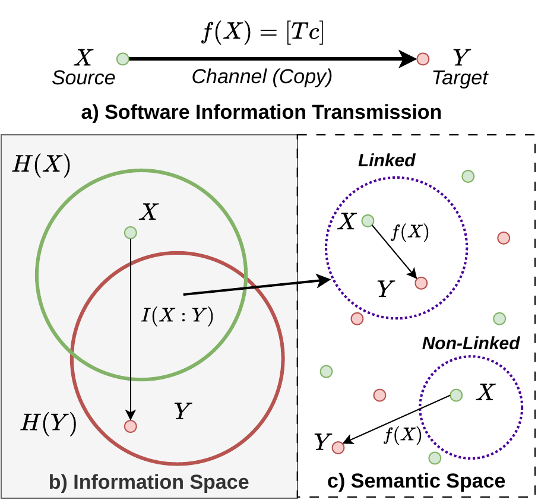</div>
<div class="caption">
    Figure 1. TraceXplainer: Using Information Theory to Interpret Unsupervised Traceability Models — software information transmission, the information space, and the semantic space.
</div>

<div align="center">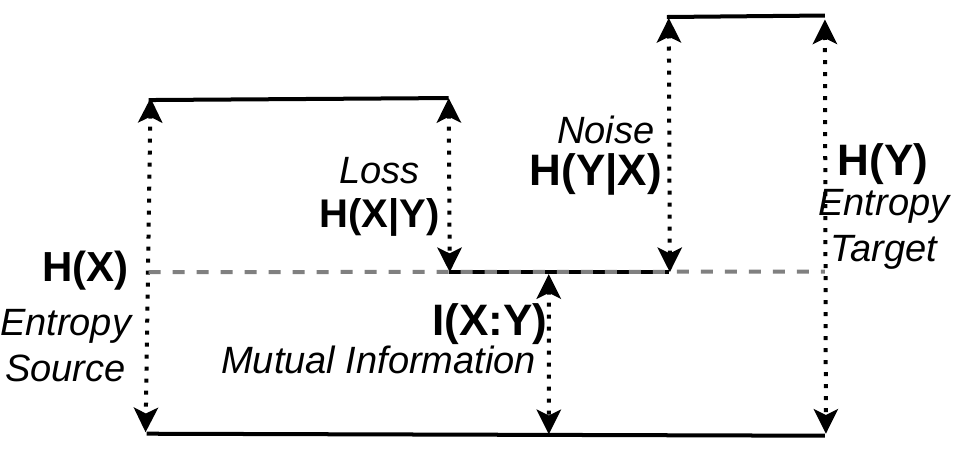</div>
<div class="caption">
    Figure 2. Information Theory Measures in TraceXplainer (self-information, mutual information, loss, and noise between source and target artifacts).
</div>

### 3.1 RQ1: Traceability Effectiveness

None of the evaluated configurations achieve strong classification performance: PR-AUC remains below 0.6 across all experiments, and although ROC-AUC reaches up to 0.76, this overstates performance given how rare true links are relative to candidate pairs (e.g., 277 out of 47,815 for iTrust). We therefore treat PR-AUC, not ROC-AUC, as the primary indicator of effectiveness. Word2vec representations (WMD and Soft-Cosine) consistently outperform doc2vec, most notably on LibEst, where PR-AUC reaches 0.56–0.59. Performance also varies notably by system: LibEst is almost always the top performer, followed by Dronology, while Cisco is consistently the weakest testbed. On LibEst, word2vec precision falls to 3.8 (Soft-Cosine) and 0.42 (WMD), and doc2vec performs poorly overall; on Dronology under word2vec, both WMD and Soft-Cosine reach higher ROC (0.71, 0.75) and precision–recall (0.13, 0.16) areas, indicating better discriminative performance across the full operating range.

<div align="center">
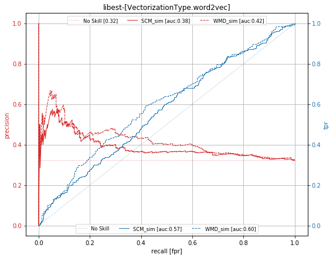
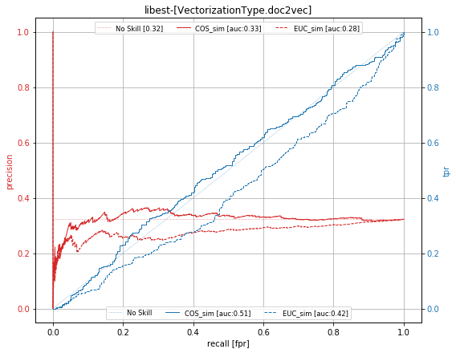
</div>
<div align="center">
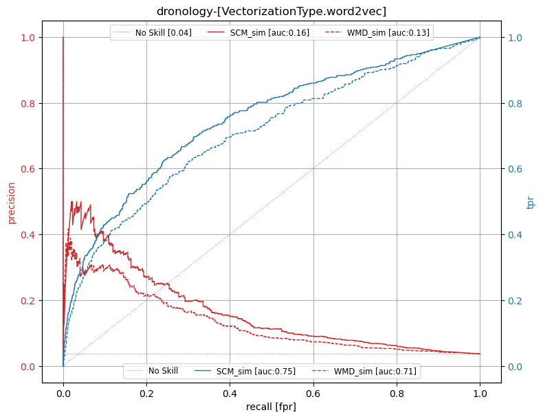
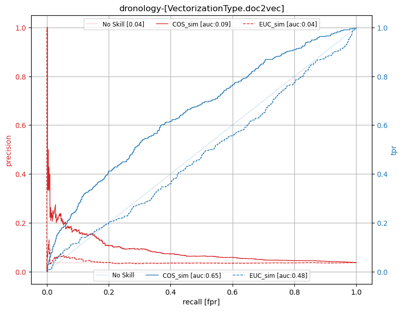
</div>
<div class="caption">
    Figure 3. Precision and Recall for word2vec (left) and doc2vec (right) using LibEst (top) and Dronology (bottom).
</div>

> **Summary**: Across all experiments, AUC precision-recall results show consistently low link-recovery performance for both doc2vec and word2vec, with word2vec only marginally ahead.

### 3.2 RQ2: Semantic Traceability Imbalance

Low Soft-Cosine similarity values (e.g., 0.1 on both Cisco and EBT) indicate weak similarity between source and target artifacts, even for confirmed ground-truth links — for instance, SMOS reports a Soft-Cosine of just 0.06 for confirmed links. The highest Word Mover's Distance similarity, 0.51 on LibEst, suggests only modest token overlap between source and target. Doc2vec exhibits comparable behavior, with Euclidean distances near the maximum (0.98) on LibEst and Cisco, whereas Dronology's larger, more diverse corpus yields much lower Euclidean distances (0.02).

> **Summary**: The traceability ground truth is heavily imbalanced between links and non-links. Cosine distance and Soft-Cosine similarity fare best under AUC, with a minimum effectiveness of 0.19 and 0.12 respectively on the Cisco testbed.

### 3.3 RQ3: Exploratory Information Theory Results

Across all experiments, the self-information $H(X)$ of source artifacts (issues, requirements, pull requests) averages 4.63 ± 1.17 bits, while the self-information $H(Y)$ of target artifacts (source code) averages 6.16 ± 0.91 bits — an average imbalance of 1.53 bits in favor of the target. Mutual information averages 4.33 ± 1.14 bits, the minimum shared entropy averages 2.43 ± 1.39 bits, and the minimum shared extropy averages 1.12 ± 0.24 bits. Loss and noise are both approximately Gaussian, with medians of 1.82 and 0.30 bits respectively — loss exceeds noise by roughly 1.52 bits on average, suggesting related-but-poorly-documented source code rather than externally injected information.

> **Summary ($AN_1$)**: On the Cisco testbed, information transmission from issues to code peaks at ≈4.52 bits. We recommend engineering teams adopt inspection procedures that refactor both requirement and code documentation to raise MI and minimum shared information.

Unfortunately, information measures are largely unaffected by whether a link is confirmed or not: $H(X)$ and $H(Y)$ are comparable across links and non-links, and mutual information, loss, and noise are indistinguishable between the two groups. This means skip-gram–based neural unsupervised techniques cannot reliably perform binary link classification from these signals alone — the data do not encode the necessary discriminative patterns. Closing this gap requires either probabilistic models that intervene on the expected value of a link, or systematic refactoring of the artifacts themselves.

> **Summary ($AN_2$)**: Although code carries more information than the corresponding issues, MI, loss, and noise are indistinguishable between confirmed links and non-links. By exposing when and why unsupervised models fail, Sense's information-theoretic measures make their effectiveness and limitations more transparent and data-driven.

### 3.4 RQ4: Correlation Results

Word Mover's Distance (WMD) similarity is predominantly positively correlated (≈0.74) with the information metrics, whereas Cosine similarity displays the opposite behavior. Mutual information is negatively correlated with WMD distance (equivalently, positively correlated with WMD similarity): more shared information implies smaller artifact distance. MI shows no comparable correlation with cosine similarity, suggesting word vectors may capture semantic relationships better than paragraph vectors, though both ultimately underperform on binary link classification.

The composable manifolds below allow inspection of a third information variable — here, loss and noise, plotted against WMD similarity and mutual information for LibEst, Cisco, and Dronology. On Cisco, loss is largest where MI and similarity are lowest, while noise is more dispersed, forming clusters at both low and high MI — suggesting that injected information is independent of artifact semantics. On LibEst, loss stays high at low MI while noise concentrates at high MI; on Dronology, MI is more condensed, loss is more dispersed, and noise concentrates at low MI.

<div align="center">
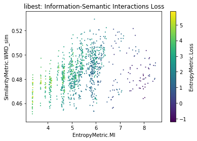
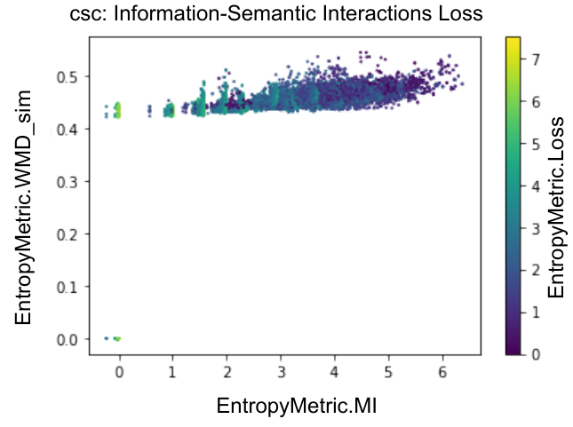
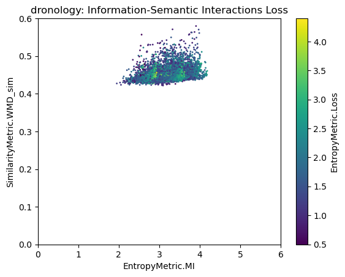
</div>
<div align="center">
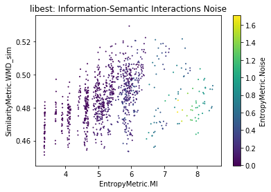
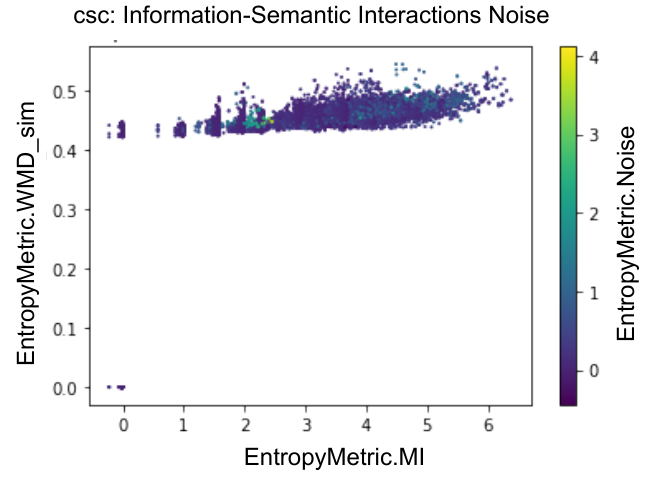
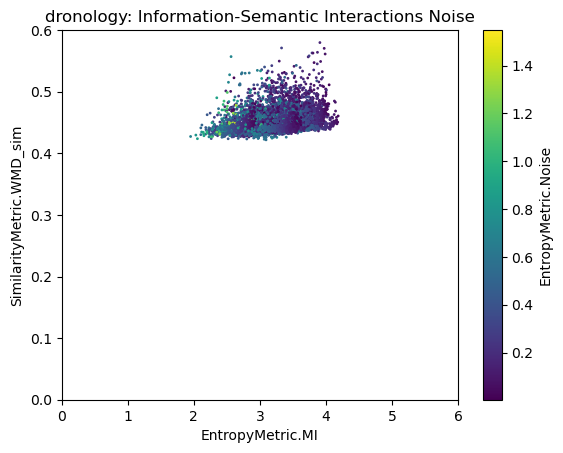
</div>
<div class="caption">
    Figure 4. Similarity vs. Mutual Information vs. Loss (top) and Noise (bottom) for LibEst, Cisco, and Dronology.
</div>

> **Summary**: Loss entropy correlates with low similarity and mutual information, pointing to a clear intervention: reducing loss in traceability datasets improves link classification. Such refactorings are practical, since practitioners routinely complete and document artifacts throughout the software life cycle.

## 4. A Case Study in Industry

This section presents four information-science cases derived from processing the Cisco testbed, an industrial corpus of pull requests and source code from a real-world Cisco engineering workflow. Each case is framed around an actionable insight that engineering teams can apply to assess and improve their traceability readiness.

**Case 0 — Diagnosing Information Imbalance Between Pull Requests and Code.** Cisco pull request comments exhibit an average self-information of 3.42 bits, while the corresponding source files reach 5.91 bits: code carries substantially more information than the pull request intended to describe it. Artifacts with low entropy (terse PR titles, single-line tickets, boilerplate templates) fail to give unsupervised techniques the lexical density needed to recover trace links; disproportionately high-entropy artifacts introduce loss and noise that obscure engineering intent. This imbalance is a leading indicator that documentation conventions, PR templates, or commit hygiene need attention before model-centric investment pays off.

**Case 1 — Detecting Under-Documented Code via Loss Extremes.** At the upper extreme, a single-token pull request (e.g., a one-word commit message) is paired with one of the highest-entropy source files in the repository — a clear signal the change description fails to capture the implementation. At the lower extreme, a fully described pull request is paired with source code whose vocabulary does not reflect the PR content at all; even a human reviewer at the 99% loss quantile for positive links would struggle to justify the association. Both extremes are actionable: the first via stricter PR description standards, the second via inline code comments or naming conventions that mirror the requirement vocabulary.

**Case 2 — Detecting Under-Documented Requirements via Noise Extremes.** In the maximum-noise scenario, a content-rich pull request is linked to an essentially empty target file, suggesting a trivial/generated implementation or a spurious link. In the minimum-noise scenario, the pull request content is repetitive and lexically narrow, providing little discriminative signal. These patterns highlight two distinct documentation debts: empty targets needing code-level comments, and repetitive PR narratives pointing to template fatigue or copy-paste change-management workflows.

**Case 3 — Surfacing Orphan Informative Links Missing From Ground Truth.** Some link candidates show strong information-theoretic alignment between source and target but are absent from the recorded ground truth. These orphan links are doubly valuable: they expose gaps in the trace matrix maintained by the engineering team (with implications for compliance, audit, and impact analysis), and they surface likely-true links independent of the unsupervised technique applied. Embedding this analysis into a CI pipeline would give release managers and compliance owners an early-warning signal for incomplete traceability records.

## 5. Lessons Learned for Industry

Our empirical study and industry-oriented case analysis yield three practical lessons for deploying unsupervised traceability in real-world settings, all supporting a shift from model-centric optimization toward data-centric practices:

1. **Traceability performance is primarily constrained by artifact informativeness and alignment, not model sophistication.** Word2vec and doc2vec fail across all configurations when artifacts lack sufficient or overlapping information. Improving requirements, pull requests, and documentation through clearer structure, consistent terminology, and completeness offers greater gains than further model tuning.
2. **Information-theoretic discrepancies (loss and noise) provide actionable signals of misalignment.** High loss indicates missing propagation of source information; noise reflects undocumented or extraneous target behavior. Both correlate with weak traceability and can guide refactoring, documentation, and QA efforts.
3. **Standard evaluation metrics alone are insufficient.** Precision, recall, and AUC can obscure limitations due to imbalance or low-information artifacts. Entropy and mutual information offer complementary insight into whether traceability is feasible at all, and help diagnose failure modes.

## Appendix:  EDA Figures 

The figures and discussion below are carried over from the original 2024 pre-print's single-system (Cisco/CSC) exploratory analysis. They predate the ICSME'26 extension's 8-testbed study in §3 above, but are kept here for historical reference and because several of the observations still hold.

### A.1 Manifold of Information Measures

<div align="center">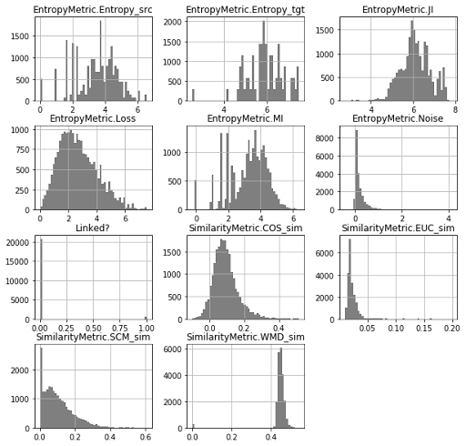</div>
<div align="center">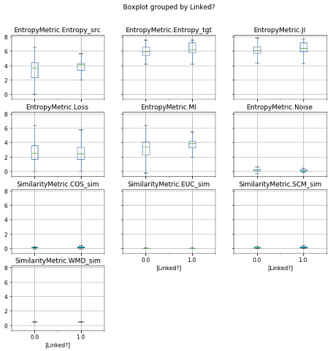</div>
<div class="caption">
    Figure A1 & A2. Probability distributions of Similarities and Information Measures (and grouped by Ground Truth) for the Cisco testbed.
</div>

The self-information of the source artifacts (issues) is on average [3.42 ± 1.31] bits, while the self-information of the target artifacts (source code) is on average [5.91 ± 0.86] bits — the source code carries 1.72 more bits than the set of issues. The mutual information averages [3.21 ± 1.19] bits, the minimum shared entropy is [1.45 ± 1.14] bits, and the minimum shared extropy is [0.87 ± 0.54] bits.

Loss and noise are both Gaussian distributions with medians of 2.53 and 0.11 bits respectively — loss exceeds noise by 2.42 bits. Given a median minimum shared entropy of 1.50 bits, the amount of lost information is high, suggesting the source code is poorly commented. The noise is barely a bit unit, indicating the code is not influenced by an external source of information.

The similarity metrics behave non-standardly: the average cosine similarity (doc2vec) is [0.09 ± 0.07], while the WMD similarity (word2vec) is [0.45 ± 0.90]. Both distributions are unimodal, indicating binary classification does not naturally emerge and the two similarities do not overlap.

> **Summary**: The maximum transmission of information was around 4.4 bits from issues to source code. We recommend that software developers implement inspection procedures to refactor documentation in both requirements and source code to enhance mutual information (and minimum shared information).

### A.2 Manifold of Information Measures by Ground Truth

Information measures are largely unaffected by whether a traceability link exists — information is independent of link status, even though all sequence-based artifacts are related somehow. This "independent" behavior does not carry over to similarity metrics such as Soft-Cosine, Euclidean, or Word Mover's Distance. Neural unsupervised techniques based on skip-gram models are unable to binary-classify a link, meaning the data do not encode the necessary patterns for classification. Intervening in the expectation value of a link (e.g., via probabilistic models) or systematic refactoring of the artifacts is needed instead.

> **Summary**: Even though the source code carries more information than the issues, MI, loss, and noise are indistinguishable between confirmed links and non-links. We expect low mutual information and high loss/noise for non-related artifacts.

### A.3 Scatter Matrix for Information Measures

<div align="center">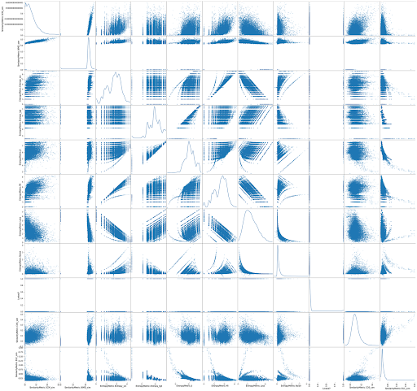</div>
<div class="caption">
    Figure A3. Correlation Analysis of Similarity and Information Measures.
</div>

Correlations help explain variables that are not easily described from their values alone. WMD similarity is mostly positively correlated (~0.74) with other information metrics, while Cosine similarity has the opposite effect.

### A.4 Mutual Information & Shared Information Entropy and Extropy

<div align="center">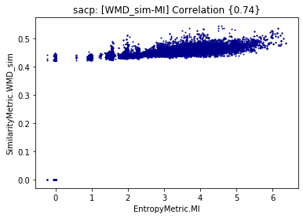</div>
<div align="center">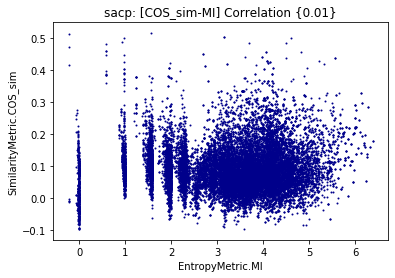</div>
<div class="caption">
    Figure A4. Similarity and Mutual Information.
</div>

Mutual information is positively correlated with WMD similarity: the larger the amount of shared information, the more similar the artifacts. However, MI is not correlated with cosine similarity — raising the question of whether word vectors capture better semantic relationships than paragraph vectors, though neither performs well under supervised evaluation.

<div align="center">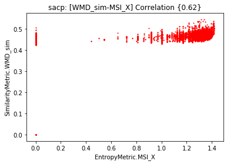</div>
<div class="caption">
    Figure A5. Similarity and Shared Information.
</div>

The minimum shared information (MSI) for entropy is also positively correlated with WMD, consistent with the mutual information trend, and extropy is positively correlated as well — further evidence that WMD similarity captures better semantic relationships among artifacts.
## Citation

To cite the extended, industry-oriented study (in submission to ICSME'26):

```bibtex
@misc{rodriguezcardenas2026sensetraceability,
      author={Rodriguez-Cardenas, Daniel and Fecko, Logan and Poshyvanyk, Denys and Palacio, David N. and Moran, Kevin},
      title={{Sense-traceability}: A Library for Software Artifact Vectorization, Distance Computation, and Statistical Analysis on Vectors},
      year={2026},
      publisher={GitHub},
      howpublished={\url{https://github.com/WM-SEMERU/Sense-traceability}},
}
```

