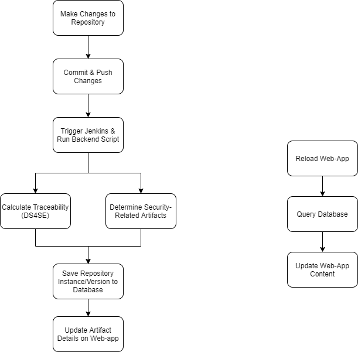

# A Traceability Tool (T-Miner) Based on Unsupervised Learners
Project Leads: @danaderp, Carlos
 
Description: Traceability is a fundamental component of modern software development processes that helps to ensure properly functioning, secure software systems. 
Agile workflows tend to emphasize rapid iteration and working prototypes over rigorous documentation, leaving little time to perform intellectually intensive traceability tasks. 
Furthermore, the highly iterative nature of agile development leads to the generation of enormous sets of interconnected artifacts that capture disparate pieces of information about the underlying system. 
Generally, past work on automating the traceability process has involved drawing relationships between development artifacts of interest, such as requirements and code, using some form of textual similarity measure. 
SEMERU lab has been developing automated approaches based on Natural Language Processing that suggest a candidate set of trace links. 
The main goal of this project is to extend the functionality of a Traceability Tool in order to integrate new components based on unsupervised learning. 
You are required to implement and refactor components in the front- and back-end. 
The team is going to be divided into 3 domains: 
- DataBase Integration, 
- Front-End Development, and 
- Back-End Development. 

## Project Description for CSCI 435/535

### Project Goals:

- [ ] Complete the navigation of the web-app 
- [ ] Consume and adapt services from the  library DS4SE. This task will need a fluent communication with the Team of Project#2, which is in charge of the Data Science interfaces, and 
- [ ] Consume and adapt services from the library SecureReqNet. This task will need a fluent communication with the Team of Project#3, which is in charge of the security interfaces

### Project Requirements:

- Required Knowledge Prerequisites: Python, JavaScript, and Git
- Preferred Knowledge Prerequisites: Machine Learning, Statistical Computing

### Recommended Readings:

- An introductory Video for Traceability [link](https://www.youtube.com/watch?v=guSAnWP9zDI&feature=youtu.be)
- A probabilistic approach to Traceability [paper](https://arxiv.org/pdf/2005.09046.pdf)
- The page of the project [link](https://semeru-code-public.gitlab.io/Project-Websites/comet-website/)

# T-Miner Documentation (Team #1)
Project Contributors: Jade Chen, Alex Fantine, John Garst, Chase Jones, Ben Krupka, and Nicholas Write

"We expect that the team documents the architecture, methodology, deployment, components, and navigation of the tool in a markdown file."

## Overview
???

## Diagrams
Processes: 
 

Components: 

## Jenkins
Jenkins [Installation](https://www.jenkins.io/doc/book/installing/)
Jenkins Setup [Documentation](https://github.com/WM-SEMERU/Neural-Unsupervised-Software-Traceability/blob/master/web-app/docs/Jenkins%20Setup.txt)

## MongoDB
MongoDB & PyMongo Installation [Documentation](https://github.com/WM-SEMERU/Neural-Unsupervised-Software-Traceability/blob/dev-branch/web-app/docs/MongoDB%20Setup.txt)

## Database Structure

## Web-App Navigation
