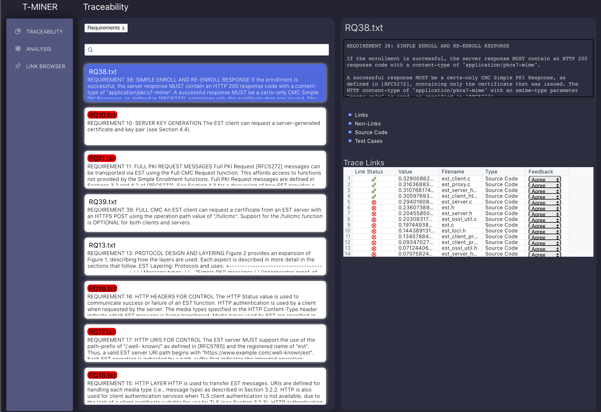
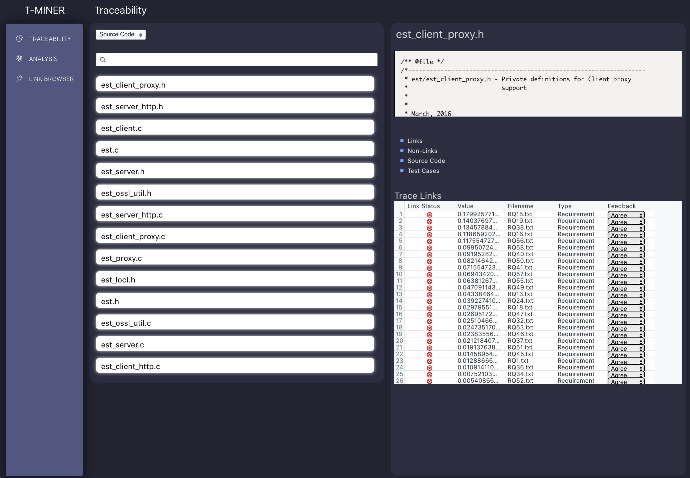
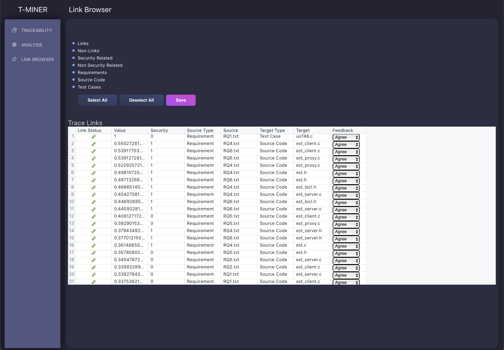

# A Traceability Tool (T-Miner) Based on Unsupervised Learners
Project Leads: @danaderp, Carlos

Description: Traceability is a fundamental component of modern software development processes that helps to ensure properly functioning, secure software systems.
Agile workflows tend to emphasize rapid iteration and working prototypes over rigorous documentation, leaving little time to perform intellectually intensive traceability tasks.
Furthermore, the highly iterative nature of agile development leads to the generation of enormous sets of interconnected artifacts that capture disparate pieces of information about the underlying system.
Generally, past work on automating the traceability process has involved drawing relationships between development artifacts of interest, such as requirements and code, using some form of textual similarity measure.
SEMERU lab has been developing automated approaches based on Natural Language Processing that suggest a candidate set of trace links.
The main goal of this project is to extend the functionality of a Traceability Tool in order to integrate new components based on unsupervised learning.
You are required to implement and refactor components in the front- and back-end.
The team is going to be divided into 3 domains:
- DataBase Integration,
- Front-End Development, and
- Back-End Development.

## Project Description for CSCI 435/535

### Project Goals:

- [ ] Complete the navigation of the web-app
- [ ] Consume and adapt services from the  library DS4SE. This task will need a fluent communication with the Team of Project#2, which is in charge of the Data Science interfaces, and
- [ ] Consume and adapt services from the library SecureReqNet. This task will need a fluent communication with the Team of Project#3, which is in charge of the security interfaces

### Project Requirements:

- Required Knowledge Prerequisites: Python, JavaScript, and Git
- Preferred Knowledge Prerequisites: Machine Learning, Statistical Computing

### Recommended Readings:

- An introductory Video for Traceability [link](https://www.youtube.com/watch?v=guSAnWP9zDI&feature=youtu.be)
- A probabilistic approach to Traceability [paper](https://arxiv.org/pdf/2005.09046.pdf)
- The page of the project [link](https://semeru-code-public.gitlab.io/Project-Websites/comet-website/)

# T-Miner (Team #1)
Project Contributors: Jade Chen, Alex Fantine, John Garst, Chase Jones, Ben Krupka, and Nicholas Wright

"We expect that the team documents the architecture, methodology, deployment, components, and navigation of the tool in a markdown file."

## Overview
### T-Miner Web-Application
T-Miner Web-App Link: http://rocco.cs.wm.edu:8080/tminer/%20

T-Miner Jenkins Link: http://rocco.cs.wm.edu:8080/jenkins

### High-Level Overview

The T-Miner web-application analyzes traceability links among requirements and source code files in a git repository and displays the analysis in a user-friendly manner. Users can navigate through software artifacts and view artifact contents, traceability link values to other artifacts, and measures of security-relatedness (for natural language requirements files). Also available is a high-level view of general analytic metrics for the entire repository, as well as a link-browser view that displays trace links across all artifacts. As changes are pushed to the repository, the web-app updates its information automatically.

The web-app involves a number of components: a Flask/React frontend, a MongoDB noSQL database, the [DS4SE](https://pypi.org/project/ds4se/) and [SecureReqNet](https://github.com/WM-SEMERU/SecureReqNet) libraries, and the Jenkins CI/CD tool. All these components are installed and set up on the local machine. Jenkins in particular can be set up to connect to a repository of your choosing.  When a developer makes a commit and pushes changes to the repository, Jenkins notifies the backend of the change and initiates an update to the database. All files in the repository are re-evaluated for traceability and security-relatedness prior to being stored in the database. Once the database is up-to-date, the latest version of data is displayed on the web-app for the user to view.

## Diagrams
### Processes:

This diagram can also be found [here](https://github.com/WM-SEMERU/Neural-Unsupervised-Software-Traceability/blob/master/web-app/docs/Processes%20Diagram.png).

### Components:

This diagram can also be found [here](https://github.com/WM-SEMERU/Neural-Unsupervised-Software-Traceability/blob/master/web-app/docs/Component%20Diagram.png).

*Note: all components are hosted on the Tower1 machine*

## Linux Services
Linux services allow us to immediately run programs when the host computer boots up. This is used to start the webserver for T-Miner. It is important to note that Jenkins is also started this way, but this was completed automatically during the download.

For more details regarding Linux Services, view `Linux_Services.md` [here](https://github.com/WM-SEMERU/Neural-Unsupervised-Software-Traceability/blob/dev-branch/web-app/docs/Linux_Services.md)

## Jenkins
Jenkins notifies the web-application of when a developer commits and pushes changes to the repository. This notification is what triggers an update of the database with the newly updated repository, which will in turn, update the content displayed on the web-application.

Jenkins' was installed using the official installation [guidelines](https://www.jenkins.io/doc/book/installing/). Setup of Jenkins required installation of Maven and Java JDK 8. The setup of Jenkins required installations of Maven and Java JDK 8. Note that Java JDK 8 must be used.

For more details regarding setup, view `Jenkins Setup.md` [here](https://github.com/WM-SEMERU/Neural-Unsupervised-Software-Traceability/blob/dev-branch/web-app/docs/Jenkins%20Setup.md).

## MongoDB
MongoDB was chosen for the document-like storage of data. Every artifact in the repo would need to be stored along with analysis results, such as traceability values, whether the artifact is security-related, etc. In this sense, having a dictionary of information per artifact was the most comprehensive structure for the team. MongoDB’s structure of databases and collections also allows for an organization of repository versions as collections and the storage of multiple repositories as different databases.

For more details regarding installation and Mongo Shell commands, view `MongoDB Setup.md` [here](https://github.com/WM-SEMERU/Neural-Unsupervised-Software-Traceability/blob/dev-branch/web-app/docs/MongoDB%20Setup.md).

## Database Structure
As mentioned in the MongoDB section above, the database is organized such that a repository has an individual database named after the repository. That database then has a separate collection for each commit or verion, named using the timestamp of the commit made. A collection stores an analysis metrics document as a dictionary of that version, and has an individual entry for each artifact in the repository.

### Database
- Key: repository name
	- Format: "repo_name"
- Collections: each version is stored individually as a collection
	- New collection is created after each commit

### Collection
- Key: timestamp of commit
	- Format: "YYYY-MM-DD 12:00:00"
- Records: each file in the repo at the time of the commit
	- Requires storing all artifacts of the commit regardless of change
- Additional Record: artifact metrics (for analysis view)

### Record (Artifact Metrics) - one per repository
- Number of documents
	- Key: “num_doc”
		- [num_req, num_src, diff_st, diff_ts]
			- All of the values in the list will be numbers
			- ‘diff_st’ means the value of the difference from source files (requirement files) to target files (source code files)
			- ‘diff_ts’ means the value of the difference from target files (source code files) to source files (requirement files)
- Vocabulary Size
	- Key: “vocab_size”
		- [vocab_req, vocab_src, diff_st, diff_ts]
- Average Number of Tokens Used
	- Key: “avg_tokens”
		- [token_req, token_src, diff_st, diff_ts]
- Requirement Vocabulary
	- Key: “rec_vocab”
		- {‘token1’ : [count, freq], ‘token2’ : [count, freq], ‘token3’ : [count, freq]}
		- Note: this does not need to be formatted as this matched the direct output from DS4SE’s Vocab method, which returns the three most common tokens and their corresponding counts/frequencies
- Source Code Vocabulary
	- Key: “src_vocab”
		- {‘token1’ : [count, freq], ‘token2’ : [count, freq], ‘token3’ : [count, freq]}
- Shared Vocabulary
	- Key: “shared_vocab”
		- {‘token1’ : [count, freq], ‘token2’ : [count, freq], ‘token3’ : [count, freq]}

### Record (Individual Artifacts) - one per artifact in the repository
- Artifact name
	- Key: "name"
- Artifact type
	- Key: "type"
	- Two types:
		- Requirement: "req"
		- Source code: "src"
- Artifact content
	- Key: "content"
		- Full file content
- Traceability links
	- Key: "links"
		- List of Tuples: [(target1, [(tech1, val)...(tech7, val)]), … (targetN, [(tech1, val)...(tech7, val)])]
- Orphan (i.e. whether or not traceability links to other artifacts exist)
	- Key: “orphan”
		- True/False
- Security-relatedness
	- Key: "security"
		- True/False/Not a requirements file

## Integration of DS4SE & SecureReqNet
**DS4SE** - *All possible artifact file pairs in the repo are checked*
- Import DS4SE Python Library
	- Input: pass in a source file and target file to a technique method (7 possible techniques methods to call)
	- Output: a tuple containing the technique used and traceability value for the observed pair of artifacts

**SecureReqNet** - *Only requirement files are tested; currently checking all natural language (.txt) files in the repo*
- Create POST request to SecureReqNet
	- Input: raw contents of artifact as string
	- Output: Boolean or string value that indicates whether or not artifact is security related
		- True: is security-related
		- False: is NOT security-related
		- “Not a requirements file”

## Flask/React Front-End
**Front-End** - Node.js server with React JS library
- 3 Views
	- Traceability
		- View either Requirements or Source Code, artifact content, and associated Trace Links
    - 
    - This image can also be found [here](https://github.com/WM-SEMERU/Neural-Unsupervised-Software-Traceability/blob/master/web-app/docs/traceabilityview1.png).
    - 
    - This image can also be found [here](https://github.com/WM-SEMERU/Neural-Unsupervised-Software-Traceability/blob/master/web-app/docs/traceabilityview2.png).
	- Analysis
		- Display overall data analysis, including Number of Documents for various artifact types, vocabulary insight, and token analysis
    - 
    - This image can also be found [here](https://github.com/WM-SEMERU/Neural-Unsupervised-Software-Traceability/blob/master/web-app/docs/analysisview.png).
	- Link Browser
		- Shows Trace Links across all artifacts, filterable by Link/Non-Links, Security/Non-security related, and Requirements/Source Code/Test Cases
    - 
    - This image can also be found [here](https://github.com/WM-SEMERU/Neural-Unsupervised-Software-Traceability/blob/master/web-app/docs/linkbrowser.png).
- Updates with latest data from database

## Web-App Navigation & Usage
- Pages
  - Traceability, Analysis, Link browser (same as above)
  - Each can either be accessed by clicking on the appropriate side-navigation link, or by going to the appropriate routed URL (http://rocco.cs.wm.edu:8080/tminer, http://rocco.cs.wm.edu:8080/analysis, http://rocco.cs.wm.edu:8080/linkbrowser)
- Filters
  - Source code and requirements can be filtered by Security/non-security related, whether they are a .txt file, and if they are orphans/non-orphans (i.e. no positive trace links)
  - Trace Links can be filtered by Links/Non-Links (i.e. whether their traceability value is above the specified threshold), and/or whether they are from Source Code or Test Cases
  - The Link Browser can be filtered by all of these parameters
  - Filters are also combinable
- Search bar
  - The Traceability view has a search bar that the user can enter text into, to find certain artifacts matching the input
- Refresh
  - Refreshing the webpage is currently the way to update the database with any new Github pushes and associated artifacts/traceability links

## Deployment
Deploying the web-app requires a user to start the web-app and database connection from the hosting machine (i.e. Tower1).

For more detailed steps, view the documentation on GitHub [here](https://github.com/WM-SEMERU/Neural-Unsupervised-Software-Traceability/blob/master/web-app/docs/Deployment.txt).
